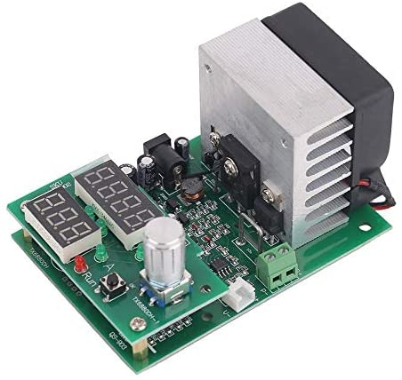

# Battery discharge logger


The constant current load can be cheaply obtained from Ali, but you might also be able to find it on ebay and Amazon for slightly higher prices. Some search terms that should yield the product on those platforms are:

* Constant Current Electronic Load Discharge Battery Capacity Tester
* Constant Current Electronic Load 60W
* ZPB30A1

One really cool feature is that this device will output the batteries current voltage via its serial port. This can then be used to generate discharging graphs:


## Installation
Make sure you have [pipenv](https://pipenv.pypa.io/en/latest/) installed. Clone the repository and run.

```
pipenv shell
```

to get all the dependencies installed.

## Running
Power up the load while pressing the **Run** button. Make sure it is in mode **Fun1**, otherwise there will be no output on the serial port. Connect your USB to serial converter - GND and TX are enough. You can use an Arduino for that (just bridge Reset and GND pin to use it as a USB to serial converter).

Before running the load invoke the logger and redirect the output to a CSV file
```
python log.py /dev/ttyUSB0 > out.csv
```
Once the logger starts beeping at you, stop logging by pressing **CTRL + C**.

After the log has been completed you can plot the CSV:

```
python plot.py out.csv result.png --title"Some tested battery"
```
